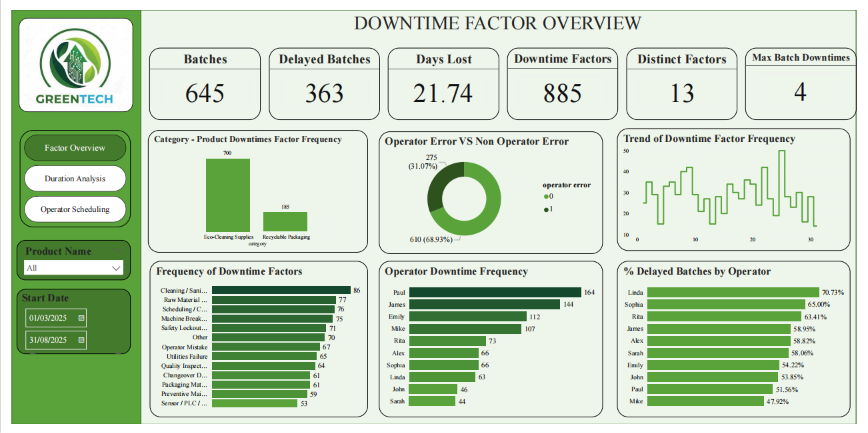
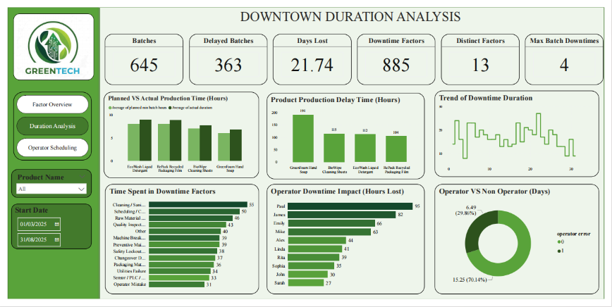
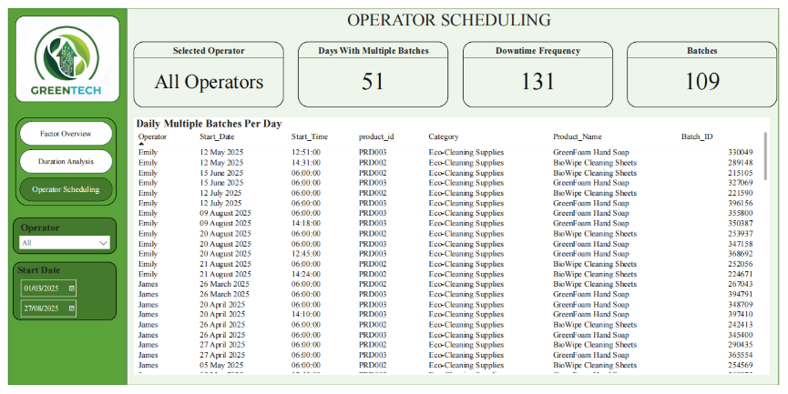

# GreenTech Production Downtime Analysis

---

## Table of Contents

- Project Overview
- Project Status
- Business Problem
- Project Objectives
- Key Questions
- Tools & Technologies
- Data Preparation
- Dataset Summary
- Data Model
- Dashboard Features
- Dashboard Preview
- Key Findings
- Recommendations
- Business Impact
- Key Learnings
- Skills Demonstrated
- Repository Contents
- Author
- Connect With Me

---

## Project Overview

This project analyzes production downtime at GreenTech Manufacturing using PostgreSQL and Microsoft Power BI. The objective was to identify the leading causes of production delays, evaluate their impact on operational efficiency, and provide actionable recommendations to improve manufacturing performance.

Through the development of interactive dashboards and business intelligence solutions, the project enables stakeholders to gain visibility into downtime trends, operator performance, production bottlenecks, and scheduling inefficiencies.

---

## Project Status

| Attribute | Details |
|----------|----------|
| Status | Completed |
| Duration | 6 Weeks |
| Project Type | Manufacturing Analytics |
| Organization | GreenTech Manufacturing (Amdari Internship) |

---

## Business Problem

GreenTech Manufacturing experienced recurring operational challenges, including:

- Production delays
- Machine downtime
- Scheduling conflicts
- Raw material shortages
- Reduced operational efficiency
- Multiple batch assignments per operator

These issues negatively impacted productivity and increased operational costs. Management required a data-driven approach to understand the underlying causes of downtime and improve decision-making across the production process.

---

## Project Objectives

- Identify the leading causes of production downtime.
- Measure the impact of delays on overall productivity.
- Analyze operator performance and scheduling patterns.
- Evaluate product-level production trends.
- Develop interactive dashboards for operational monitoring.
- Provide actionable recommendations to improve efficiency.

---

## Key Questions

- What are the primary causes of production downtime?
- Which products experience the highest production delays?
- How much production time is lost due to downtime?
- Are downtime incidents primarily operator-related or process-related?
- Which operators record the highest downtime frequencies?
- How do scheduling patterns contribute to operational inefficiencies?
- What opportunities exist to improve production efficiency?

---

## Tools & Technologies

- PostgreSQL
- SQL
- Microsoft Power BI
- DAX
- Power Query
- Data Modeling
- Git & GitHub

---

## Data Preparation

The dataset underwent several preparation steps prior to analysis:

- Imported and queried production data using PostgreSQL.
- Validated and standardized date/time fields.
- Established relationships between production, downtime, products, and factors tables.
- Created calculated columns and DAX measures.
- Developed KPIs for downtime, delayed batches, and operational performance.
- Applied data modeling techniques to support cross-dashboard filtering.

---

## Dataset Summary

| Metric | Value |
|-------|------:|
| Production Batches | 645 |
| Delayed Batches | 363 |
| Downtime Incidents | 885 |
| Distinct Downtime Factors | 13 |
| Days Lost | 21.74 |
| Days with Multiple Batch Assignments | 51 |

---

## Data Model

The project utilized a star schema consisting of four primary tables:

- Batch Production Table
- Downtime Table
- Downtime Factors Table
- Products Table

Relationships were established within Power BI to support dynamic filtering and cross-dashboard analysis.

---

## Dashboard Features

### Downtime Factor Overview

- Downtime frequency analysis
- Operator vs Non-Operator downtime analysis
- Delayed batch percentages by operator
- Downtime trend analysis

### Duration Analysis

- Planned vs Actual production time
- Product-level production delays
- Time spent by downtime factor
- Operator downtime impact analysis

### Operator Scheduling

- Daily multiple batch assignments
- Operator workload analysis
- Scheduling pattern identification
- Downtime frequency by operator

---

## Dashboard Preview

### Downtime Factor Overview

### Duration Analysis

### Operator Scheduling

### View Full Interactive Dashboard Showcase

[Download Full Dashboard Presentation (PDF)](GreenTech_Executive_Presentation.pdf)

---

## Key Findings

- 56.3% of production batches experienced delays.
- Cleaning and sanitation activities were identified as the most frequent causes of downtime.
- GreenFoam Hand Soap recorded the highest production delays among all products.
- Approximately 69% of downtime incidents were process-related rather than operator-related.
- Multiple batch assignments occurred across 51 production days.
- Operator-related downtime accounted for approximately 31% of all downtime incidents.
- James and Emily recorded the highest number of downtime occurrences among operators.

---

## Recommendations

1. Implement preventive maintenance schedules to reduce machine-related downtime.
2. Introduce automated inventory monitoring systems to minimize material shortages.
3. Optimize workforce scheduling to reduce multiple batch assignments.
4. Provide targeted operator training for recurring performance issues.
5. Deploy real-time operational dashboards for continuous monitoring.
6. Conduct regular reviews of high-risk production processes.
7. Establish downtime KPIs to track performance improvements over time.

---

## Business Impact

The analysis identified critical operational bottlenecks responsible for over half of production delays. By implementing the proposed recommendations, GreenTech Manufacturing could potentially:

- Reduce production downtime.
- Improve batch completion rates.
- Increase operational efficiency.
- Minimize scheduling conflicts.
- Enhance workforce productivity.
- Improve data-driven decision-making across the organization.

---

## Key Learnings

Through this project, I strengthened my ability to:

- Develop end-to-end business intelligence solutions.
- Build interactive Power BI dashboards.
- Write advanced SQL queries.
- Perform operational and manufacturing analytics.
- Translate business requirements into data solutions.
- Present analytical findings to stakeholders.
- Develop actionable business recommendations.

---

## Skills Demonstrated

- SQL Querying
- PostgreSQL
- Power BI
- DAX
- Power Query
- Data Modeling
- Dashboard Design
- Business Intelligence
- Manufacturing Analytics
- Data Visualization
- Data Storytelling
- Stakeholder Reporting

---

## Repository Contents

| File | Description |
|------|-------------|
| GreenTech_Production_Downtime_Analysis.pbix | Power BI project file |
| GreenTech_SQL_Scripts.sql | SQL scripts used for analysis |
| GreenTech_Final_Report.docx | Final business report |
| GreenTech_Executive_Presentation.pdf | Executive presentation |
| dashboard-overview.png | Downtime dashboard |
| dashboard-duration-analysis.png | Duration analysis dashboard |
| dashboard-operator-scheduling.png | Operator scheduling dashboard |
| README.md | Project documentation |

---

## Author

**Sarah Abhulimhen**

---

## Connect With Me

- LinkedIn: https://www.linkedin.com/in/sarah-abhulimhen-7353213ba/
- GitHub Portfolio: https://github.com/Sarah-Abhulimhen
- Email: sarahabhulimhen9@gmail.com

© 2026 Sarah Abhulimhen
